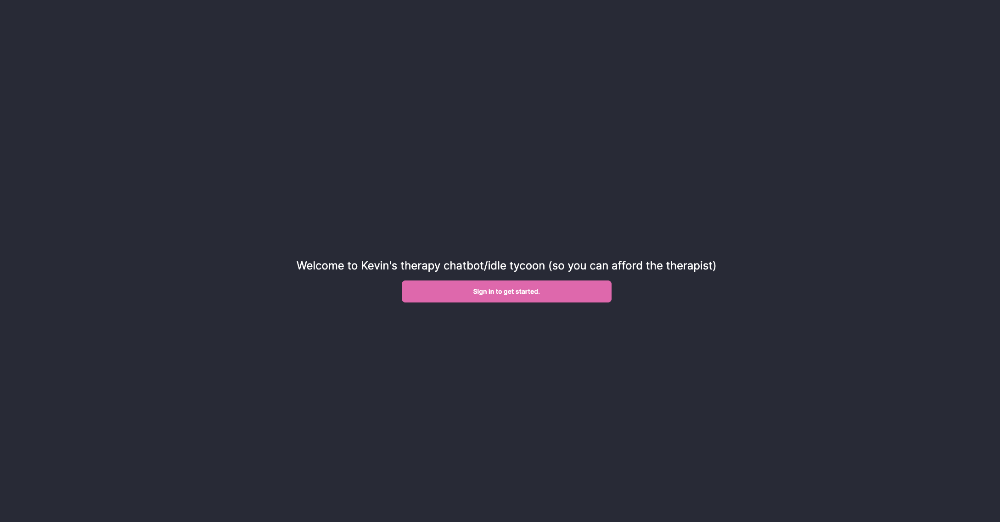
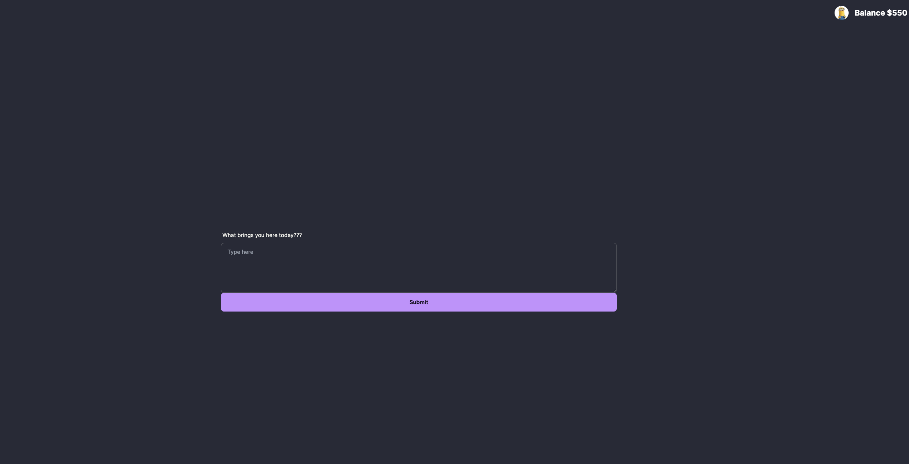
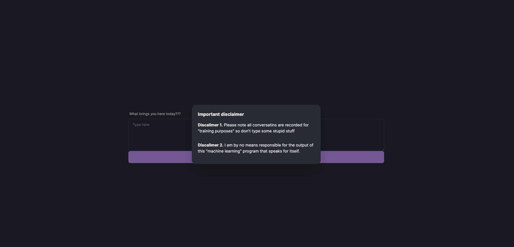
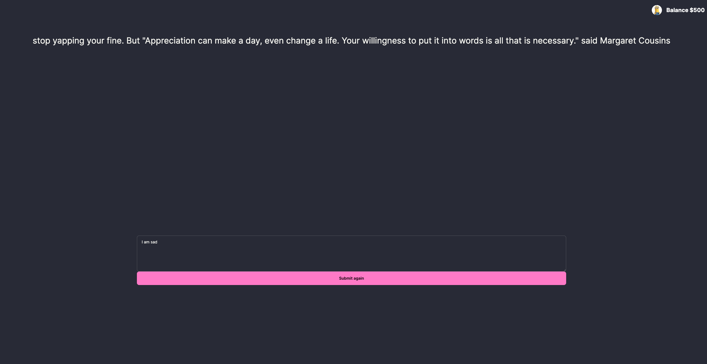

# Used and verified by many notable people in the software development industry!
## These include, but not limited to. 

Branda Zhong - Software Developer
 
Evan Kohilas [@ekohilas](https://github.com/ekohilas) - Senior developer at Constaninople

Richard Buckland ( I think he signed it. No promises. ) - Senior lecturer at UNSW

Mukund - Wisetech's very own associate software developer

Xuan Li - Cadetship at UBS? Second year at UNSW. 

Lael Grant - LEAD educator at Grok Academy.

Kristian Mansfield - Cybersecurity Lecturer at UNSW CSE

# What people are saying about therapychatbotidletycoon

> Of course, Kevin Huang gave the capital D Depression - Yanxi

___

this is a therapy app that cures all your problems!
give it a try at [link](https://therapy-chat-bot-idle-tycoon.vercel.app/)

here are some demo photos

